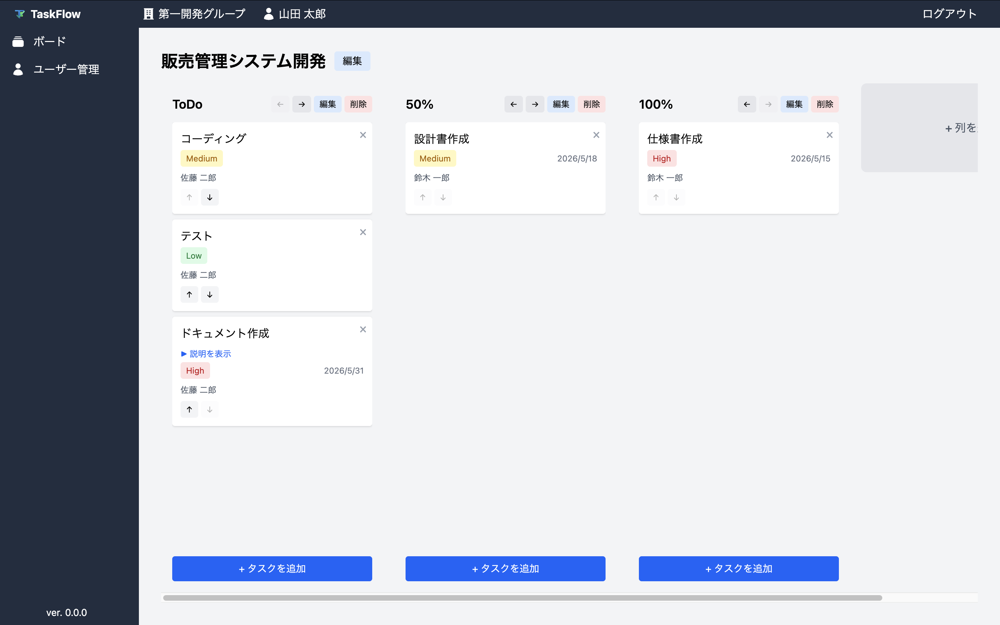

# TaskFlow


チームで利用できるカンバン方式でシンプルなタスク管理Webアプリです。

---

## スクリーンショット

https://github.com/user-attachments/assets/0c6feb3b-5086-4a36-92b8-8884019ce36b

https://github.com/user-attachments/assets/445f619f-5a05-4a5d-ad51-7597fbbbc20c

https://github.com/user-attachments/assets/a31ca68e-702b-4a38-babf-cfe428ca7165



---

## 機能一覧

- 認証
    - ログイン、ログアウト
- テナント管理
    - 1つの組織(グループ) を 1テナントとみなして、複数のチームを管理できます
- ユーザー管理・権限設定
- タスク管理
    - ボード、列、タスクの作成・編集・削除

---

## 技術スタック

### フロントエンド

- React
- TypeScript
- TailWindCSS

### バックエンド

- ASP.NET Core (.NET 10)
- Entity Framework Core
- XUnit (Unitテスト、Integrationテスト)

### データベース

- PostgreSQL

---

## 実行

Dockerが構築されたローカル環境があれば、クイックスタートできます。

### 1. サービス起動

ソースをclone後、リポジトリのルートディレクトリで以下の通りにサービスを起動します。

```bash
# ビルド
docker compose -f compose.demo.yml build

# サービスの実行
docker compose -f compose.demo.yml up -d
```

実行後、しばらく経過してから下記のURLとアカウント情報を使ってご利用ください。

| 項目        | 内容                          | 備考                                               |
| ----------- | ----------------------------- | -------------------------------------------------- |
| ログインURL | http://localhost:8080         |                                                    |
| Swagger     | http://localhost:8080/swagger | ログイン後に左記URLを開くことでAPIを実行できます。 |

| メールアドレス       | パスワード | 権限           |
| -------------------- | ---------- | -------------- |
| `root@example.com`   | root       | テナント管理者 |
| `admin@example.com`  | admin      | 管理者         |
| `sample@example.com` | sample     | 一般ユーザー   |

### 2. サービス終了

サービスを終了するには以下を実行します。  
※イメージ、ボリューム等のTaskFlowに関連するリソースもクリーンアップします。

```bash
docker compose -f compose.demo.yml down --rmi all --volumes --remove-orphans
```

---

## 今後の機能追加案

- [ ] ダッシュボード機能 (期限・優先度・プロジェクトなどで集計)
- [ ] 通知機能 (期限が近づいている/過ぎたタスクの通知)
- [ ] トークン認証 / APIキー認証
- [ ] レスポンシブUI対応

---
